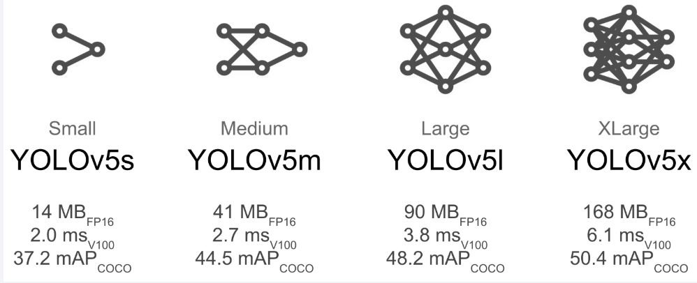
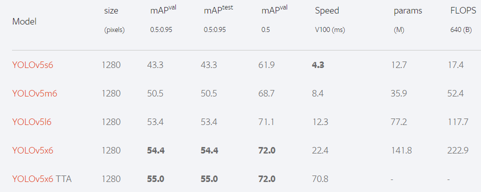
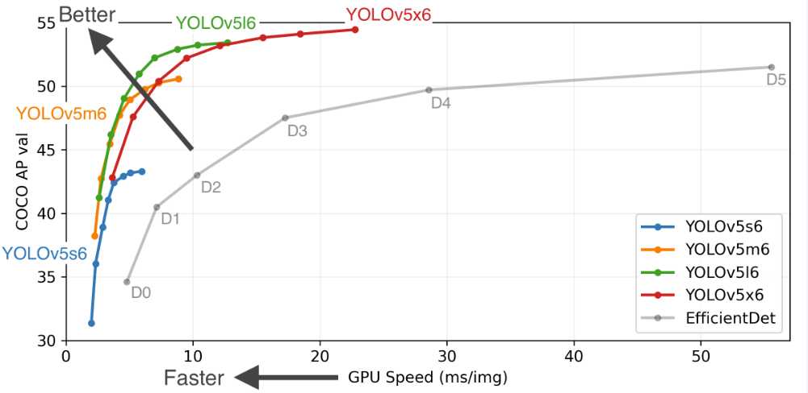
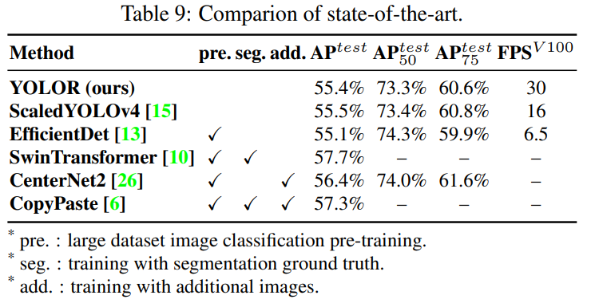
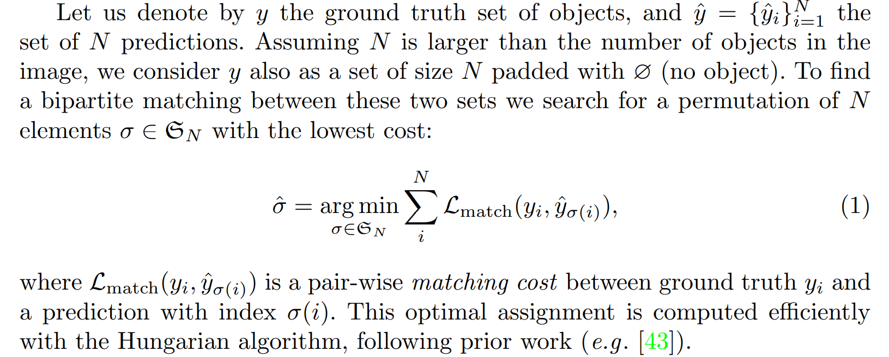

## [Milestones in state-of-the-art Object Detection](https://viso.ai/deep-learning/object-detection/)
The field of object detection is not as new as it may seem. In fact, object detection has evolved over the past 20 years. The progress of object detection is usually separated into two separate historical periods (before and after the introduction of Deep Learning):

* Before 2014 – Traditional Object Detection period
  * Viola-Jones Detector (2001), the pioneering work that started the development of traditional object detection methods
  * HOG Detector (2006), a popular feature descriptor for object detection in computer vision and image processing
  * DPM (2008) with the first introduction of bounding box regression

* After 2014 – Deep Learning Detection period
  * Most important two-stage object detection algorithms
    * RCNN and SPPNet (2014)
    * Fast RCNN and Faster RCNN (2015)
    * Mask R-CNN (2017)
    * Pyramid Networks/FPN (2017)
    * G-RCNN (2021)

  * Most important one-stage object detection algorithms
    * YOLO (2016)
    * SSD (2016)
    * RetinaNet (2017)
    * YOLOv3 (2018)
    * YOLOv4 (2020)
    * YOLOv5
    * YOLOX
    * YOLOR (2021)

[YOLOv5](https://pytorch.org/hub/ultralytics_yolov5)

[YOLOR](https://arxiv.org/pdf/2105.04206v1.pdf)

A unified network is proposed to
encode implicit knowledge and explicit knowledge together,
just like the human brain can learn knowledge from normal
learning as well as subconsciousness learning. The unified
network can generate a unified representation to simultaneously serve various tasks. 

The results demonstrate
that when implicit knowledge is introduced into the neural
network, it benefits the performance of all tasks. We further
analyze the implicit representation learnt from the proposed
unified network, and it shows great capability on catching
the physical meaning of different tasks. 

The source code of
this work is at : https:// github.com/WongKinYiu/yolor.

[DETR](https://arxiv.org/pdf/2005.12872v3.pdf)

DEtection TRansformer (DETR)

DETR directly predicts (in parallel) the final set of detections by combining
a common CNN with a transformer architecture. During training, bipartite matching
uniquely assigns predictions with ground truth boxes. Prediction with no match should
yield a “no object” (∅) class prediction.

Object detection set prediction loss

VoxelNet
VoteNet
PixelRCNN
PointNet
