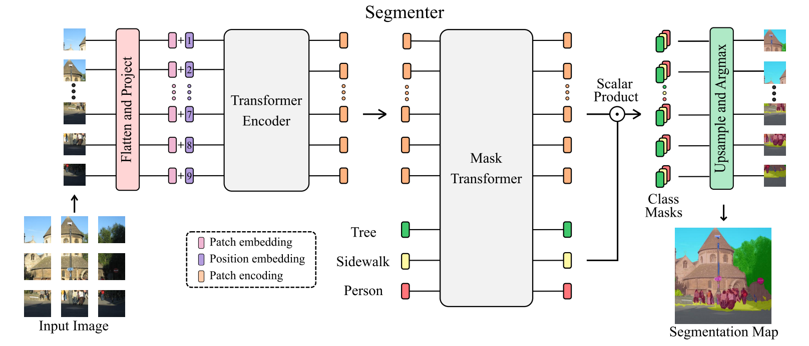

[Accurate and robust deep learning-based segmentation of the prostate clinical target volume in ultrasound images](https://www.sciencedirect.com/science/article/pii/S1361841519300623)

[Panoptic Segmentation: Unifying Semantic and Instance Segmentation](http://presentations.cocodataset.org/COCO17-Invited-PanopticAlexKirillov.pdf)

[Segmenter: Transformer for Semantic Segmentation](https://arxiv.org/pdf/2105.05633.pdf)
[code](https://github.com/rstrudel/segmenter)

In contrast to convolution-based methods, our approach
allows to model global context already at the first layer
and throughout the network. We build on the recent Vision
Transformer (ViT) and extend it to semantic segmentation.

However, the modeling of global interactions comes at a quadratic cost which makes such methods prohibitively expensive when applied to raw image pixels [11].

Transformer Encoder
L layers, multi-headed self-attention (MSA), ponit-wise MLP, Layer Norm (LN)

The self-attention mechanism:

